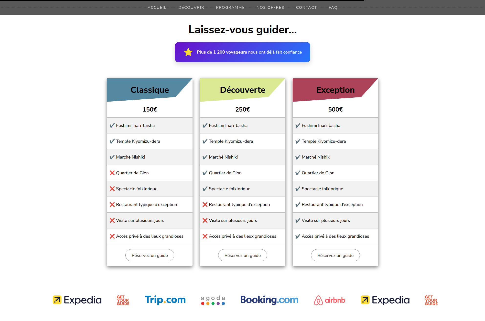

# 🏮 Chemins de Kyoto

Site vitrine touristique mettant en avant **Kyoto** : temples, paysages exceptionnels, gastronomie et itinéraires exclusifs.  
Il présente des **offres de guides locaux** et des expériences premium pour les voyageurs.  

Projet conçu dans un objectif de **portfolio**.

## 🚀 Démo

👉 [Lien vers la démo en ligne]

## ✨ Caractéristiques

- Site **responsive** (ordinateur / tablette / mobile)
- Design moderne et épuré
- Animations (fade-in, machine à écrire, barre de progression, confettis 🎉, etc.)

## 🛠️ Technologies

- HTML5
- CSS3 (Grid, Flexbox, animations, responsive design)
- JS Vanilla + GSAP (GreenSock Animation Platform)

## 📸 Aperçu

